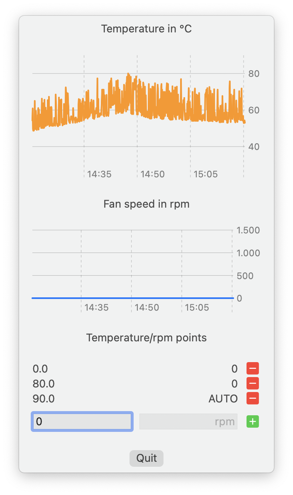

# SilentStudio
Set fan speed of Mac Studio.

> :warning: Apple's default fan speeds of 1300 rpm (1st generation) and 1000 rpm (2nd generation) for the Studio are
> set very cautious. Apple lets the same SoC's used in the Studio to go to around 104° Celsius (M2) and 108° Celsius
> (M3) in their MacBook Pro's ([source](https://youtu.be/uxyGSSu9Q9I?si=JaYaiFcUIJzUay7p&t=625)). Mac Studio's passive
> cooling is so good that it's feasible to **disable the fan completely most of the time** without reaching the
> critical limit of 100° Celsius.



## Installation instructions

I separated IOServiceConnection into a separate file to reuse it in the menu app. Unfortunately Swift (as an interpreter) is not able to handle scripts with multiple source files. We have to compile it together:

```
swiftc SilentStudio.swift IOServiceConnection.swift -o SilentStudio
swiftc SilentStudioMenuApp.swift IOServiceConnection.swift -o SilentStudioMenu
sudo chown root SilentStudio
sudo chmod +s SilentStudio
```

With the last two commands you don't need sudo for every invocation of SilentStudio from the commandline. If you want to use the SilentStudioMenu app, they are mandatory. SilentStudioMenu will invoke SilentStudio to set the fan speed. 

Besides the refactoring of IOServiceConnection, SilentStudio has one more option "-f" to set the fan speed directly.

## How to use the command line script
Inside terminal:
```
./SilentStudio -h
usage: SilentStudio [--] [<temp> <rpm>]* [-d] [-h] [-i <sec>] [-s <sensor>*]

  options
  <temp> <rpm>     Pair(s) of temperature and rpm. "AUTO" for automatic setting. Default: [(key: 0.0, value: "0"), (key: 80.0, value: "0"), (key: 90.0, value: "AUTO")]
  -d               Debug mode. List every value read and written
  -f <rpm>         Set fans to rpm and exit
  -h               This help text
  -i <sec>         Checks every <sec> seconds. Default: 30.0
  -s <sensor>*     List of sensors to read. Default: ["Tp02"]
          
 Program will run in an endless loop. Use ctrl-c to stop. Fans will be resetted to AUTO mode.
```
If you forget the sudo part, it will remind you:
```
dirk@Mac-Studio-von-Dirk SilentStudio % ./SilentStudio.swift 
2022-11-14 12:11:06 current: 58.44, last: 0.0, rpm: 1338.091,1315.7894
2022-11-14 12:11:06 change: Set fans to 0 rpm
2022-11-14 12:11:06 set  F0Md: 1
2022-11-14 12:11:06 catched error: -536870207. started with sudo?
```
Stop the script with ctrl-c. It will reset both fans to "AUTO" mode.

## How does it work?
The script uses a small dictionary `targetrpm`to set the rpm values of both fans inside the Mac Studio whenever a temperature "border" has been crossed.
The default setting switches the fan off for temperatures below 80°C and switches to "AUTO" mode whenever the temperature crosses 90°C. "AUTO" is the builtin standard behaviour. It always seems to be in the range from 1000-1015 rpm. The temperature is checked every 30 seconds.

| Temperature in °C| rpm |
| ----------- | --- |
| 0 | 0 |
| 80 | 0 |
| 90 | AUTO |

## How to change default behaviour?
Use the commandline arguments described above:
 - with `-i` you can change the `checkinterval`
 - with `-s` you can change the sensors 
 - with `-d` you can switch on debug mode (will log every value read and written from/to SMC)
 - arguments without a flag define the temperature curve. Please notice that in a list of e.g `0 0 80 0 90 AUTO` the temperature 80°C will be used to switch the fans of, regardless if the temperature is currently falling or rising. This way there is a bulitin hysteresis. 

# Disclaimer
Use on your own risk. Don't use with CPU/GPU intensive tasks.
